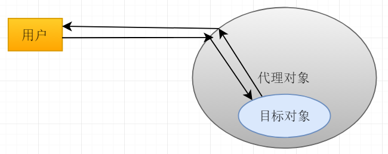

## 何为代理？

&nbsp;&nbsp;&nbsp;&nbsp;代理其实就是一种设计模式。它主要是为了提供对目标对象的**控制访问**和**功能拓展**。



&nbsp;&nbsp;&nbsp;&nbsp;代理是符合了软件开发的OCP原则的，即对修改封闭，对拓展开放。

&nbsp;&nbsp;&nbsp;&nbsp;对于一个已经具有固定功能的POJO来说，若在未来需要增加一些功能，是不应该直接修改代码的，这会破坏OCP，并且会造成测试的繁琐。
因此就需要提供能够对POJO拓展的接口，一般通过回调函数实现，Java中即是抽象方法。而代理，也能实现该功能。代理对象不仅能对目标对象起到控制访问的作用，
还能进一步拓展目标对象的功能。

&nbsp;&nbsp;&nbsp;&nbsp;这就好比经纪人和明星的关系。对于客户请求，是经纪人先收到并且先处理繁杂的事务，最后将纯粹的目的交由明星。

<hr>

## 静态代理
&nbsp;&nbsp;&nbsp;&nbsp;静态代理是通过**实现目标类的接口**或者去**继承目标类的的父类**实现的。这也造成了静态代理的局限性，只能服务于某个固定的
接口或者父类。

```java
package org.xli.static_proxy;

/**
 * 人类接口
 * 
 * @author xli
 */
public interface IPerson {
	/**
	 * 吃饭功能
	 * 
	 * @return 吃饭是否成功
	 */
	boolean eat();
}
```

```java
package org.xli.static_proxy;

/**
 * 定义一个我
 *  
 * @author xl
 */
public class Me implements IPerson {
	public Me() {}
	
	@Override
	public boolean eat() {
		System.out.println("-我吃饭了");
		return true;
	}
}
```

```java
package org.xli.static_proxy;

/**
 * Person的代理类
 * 
 * @author xl
 *
 */
public class PersonProxy implements IPerson {
	/**
	 * 目标对象
	 */
	private IPerson targetObject;
	
	public PersonProxy(IPerson person) {
		this.targetObject = person;
	}
	
	@Override
	public boolean eat() {
		System.out.println("吃饭前:准备筷子、擦桌子");
		targetObject.eat();
		System.out.println("吃饭后:洗碗");
		return true;
	}
}
```

>运行结果:
吃饭前:准备筷子、擦桌子
-我吃饭了
吃饭后:洗碗

**总结**:静态代理可以完成代理，并且符合OCP。但是因为静态代理的代理类是在**编译期**写死的，就造成静态代理的局限，只能服务于某个类。
因此，当目标类增多后，就要准备多个代理类。

## JDK代理(接口代理)

&nbsp;&nbsp;&nbsp;&nbsp;JDK代理通过在**运行期**修改class字节码，借用Java动态加载类的机制来完成动态代理。其基本思想是在运行期构造一个
实现目标类所有接口的类作为代理类。这就使得代理具有普遍性，因为代理类是动态产生的。

```java
public T getProxy() {
    return (T) Proxy.newProxyInstance(targetObject.getClass().getClassLoader(), 
        targetObject.getClass().getInterfaces(),
        new InvocationHandler() { 							//InvocationHandler就是一个函数指针的作用，用于回调
        @Override
        public Object invoke(Object proxy, Method method, Object[] args) throws Throwable {
          DoProxyChain chain = new DoProxyChain(interpecterChain, targetObject);
          chain.doChain(method, args);					//这里是自己实现的一个链式调用目标方法执行前的拦截器
          return chain.getResult();
        }
    });
}
```

**总结**：因为JDK代理是通过接口实现代理的，因此只能代理目标类的**接口方法**。

## CGLIB代理(子类代理)

&nbsp;&nbsp;&nbsp;&nbsp;CGLIB代理也是动态代理，但是它是通过在运行期使代理类继承目标类来实现的。

```java
public T getProxy() {
    Enhancer enhancer = new Enhancer();
    enhancer.setSuperclass(targetObject.getClass());
    enhancer.setCallback(new MethodInterceptor() {
        @Override
        public Object intercept(Object proxy, Method method, Object[] args, MethodProxy methodProxy) throws Throwable {
          DoProxyChain chain = new DoProxyChain(interpecterChain, targetObject);
          chain.doChain(method, args);						//这里是自己实现的一个链式调用目标方法执行前的拦截器
          return chain.getResult();
        }
    });

    return (T) enhancer.create();
}
```

**总结**：因为CGLIB代理通过继承目标类实现的，因此他**不能代理终态方法**，即final方法。

## 代理总结

* 静态代理：静态代理是通过实现目标类的接口或者继承目标类的超类实现的。代理类是在**编译期**决定的。这就造成了代理类的局限性，只能代理某个类。

* 动态代理：动态代理之所以动态，是因为代理类是在**运行期**决定的，是通过修改字节码构建代理类的。而JDK代理和CGLIB代理使用两种代理策略。
**JDK代理的方案**：实现目标类的所有接口，因此可以代理接口规定的方法。因此也叫做接口代理。**CGLLIB代理的方案**：继承目标类，因此可以代理目标类的所有
可继承方法。因此也叫作子类代理。
